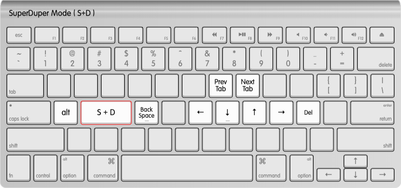
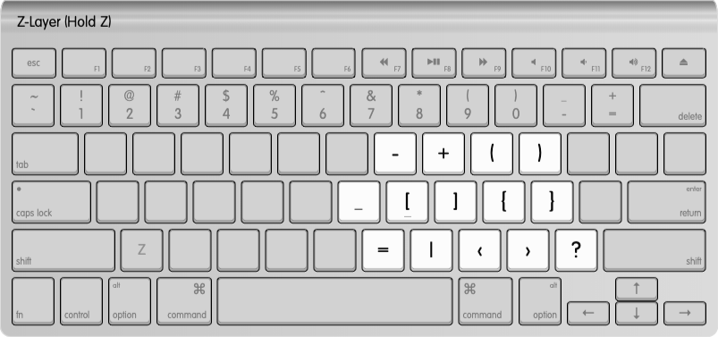

# Keyboard

## Mechanical Keyboards

## [QMK](https://qmk.fm/)

* [My Planck Firmware](https://github.com/qmk/qmk_firmware/tree/master/keyboards/planck/keymaps/narze)
* [My Ergodox Infinity Firmware](https://github.com/qmk/qmk_firmware/tree/master/keyboards/ergodox_infinity/keymaps/narze)

Many custom built mechanical keyboard nowadays are using QMK as the firmware. I can fully customize all the keys and layers to suit my needs. I can type in Colemak or even use [SuperDuper mode](./#simultaneous-vi-mode-s-uper-d-uper-mode) on other computers.

### Planck Keyboard

A 40% ortholinear keyboard which does not have functions & number rows at all. But instead can be typed by using `Lower` & `Raise` modifier keys.

### Ergodox Infinity

My first split keyboard. I like the thumb keys and the mini LCD screens. I use similar layout as the Planck. Plus some more keys at the thumb.

## [Simultaneous Vi Mode](https://github.com/tekezo/Karabiner/blob/05ca98733f3e3501e0679814c3795d1cb57e177f/src/core/server/Resources/include/checkbox/simultaneouskeypresses_vi_mode.xml#L4-L10) / [\(S\)uper \(D\)uper Mode](https://github.com/jasonrudolph/keyboard#super-duper-mode)

This setup tremendously improve my typing and coding productivity as I don't have to reach for arrow keys anymore. I implemented this mode both in software layer via [Karabiner Elements](https://github.com/tekezo/Karabiner-Elements) via [Goku](https://github.com/yqrashawn/GokuRakuJoudo) \([link](https://github.com/narze/laptop/blob/master/etc/karabiner.edn#L33)\), and in hardware layer with [QMK](https://qmk.fm/). To activate this mode, press `S`+`D` at the same time then hold. You can use this mode to navigate tabs too.

## Dev Mode with Z-Layer

I add another layer to type symbols which are heavily used in coding. I choose `Z` key as it is near the shift key and not being used that much \(`Q` is less frequently used but sometimes hard to reach\)

I use [Keyboard Layout Editor](http://www.keyboard-layout-editor.com) to maintain the layout designs.

## Keyboard Layouts

I use [Colemak](https://colemak.com/) for English and [Pattachote](https://en.wikipedia.org/wiki/Thai_Pattachote_keyboard_layout) for Thai. I so tried [Workman](https://workmanlayout.org/) and [Norman](https://normanlayout.info/) for a short while.

